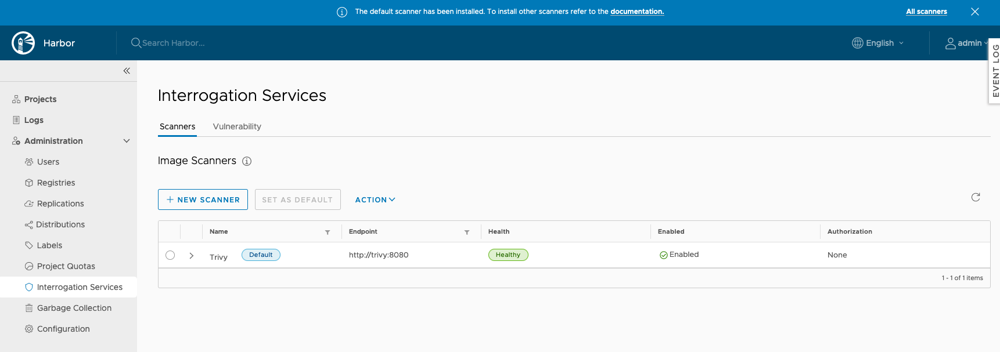

# Registry Module version 1.1.0

This module currently is composed mainly of the Harbor. Harbor updates the software and we want to include these
updates in our module. Also, this update includes a new Harbor distribution, this time includes Trivy
as a container analysis solution instead of using Clair. We choose to add Trivy support because Harbor announced it
will become the default container analysis scanner starting from version 2.2.

> Clair Image Scanner will be officially deprecated as an embedded scanner option in the next Harbor v2.2 release.
> This means it will no longer be available during initial installation and must be deployed and paired with Harbor
> like any other external scanner. For users upgrading from a Harbor deployment with Clair as the default scanner,
> it is recommended to upgrade with Trivy as the default scanner instead.
>
> *Source: <https://goharbor.io/blog/harbor-2.1/>*

## Changelog

- Update Harbor from version `v2.0.2` to `v2.1.1`
- Add a new Harbor distribution. [`full-harbor-with-trivy`](../../katalog/harbor/distributions/full-harbor-with-trivy)

## Upgrade path

### Important note

This new release requires to have previously installed
[cert-manager v1](https://github.com/sighupio/fury-kubernetes-ingress/tree/v1.8.0/katalog/cert-manager)
witch is included in the [fury-kubernetes-ingress](https://github.com/sighupio/fury-kubernetes-ingress) starting from
[v1.8.0](https://github.com/sighupio/fury-kubernetes-ingress/releases/tag/v1.8.0) version.

Please follow carefully the
[upgrade path of cert-manager](https://github.com/sighupio/fury-kubernetes-ingress/blob/master/docs/releases/v1.8.0.md#cert-manager).

### From and to full-harbor distribution

To upgrade the Harbor package from `v1.0.1` to `v1.1.0`, you need to download this new version, then apply the
`kustomize` project. No further action is required.

**NOTE:** Be sure you run [cert-managet v1](#important-note) before upgrade.

```bash
kustomize build katalog/harbor/distributions/full-harbor | kubectl apply -f -
```

### From full-habor to full-harbor-with-trivy

If you want to change from Clair to Trivy as your container analysis system, follow these instructions.

**NOTE:** Be sure you run [cert-managet v1](#important-note) before upgrade.

If you deployed Harbor following the [full-harbor example](../../examples/full-harbor):

- Remove `clair` configMapGenerator.
- Add `trivy` configMapGenerator with this configuration parameters:
  - `HTTP_PROXY`=
  - `HTTPS_PROXY`=
  - `SCANNER_LOG_LEVEL`=debug
  - `SCANNER_TRIVY_DEBUG_MODE`=true
  - `SCANNER_TRIVY_VULN_TYPE`="os,library"
  - `SCANNER_TRIVY_SEVERITY`="UNKNOWN,LOW,MEDIUM,HIGH,CRITICAL"
  - `SCANNER_TRIVY_IGNORE_UNFIXED`="false"
- Remove `clair` secretGenerator.
- Add `clair` secretGenerator with this configuration parameters:
  - `SCANNER_TRIVY_GITHUB_TOKEN`=
- Change the base from `katalog/harbor/distributions/full-harbor` to `katalog/harbor/distributions/full-harbor-with-trivy`
- Delete any line containing `clair`|`CLAIR` in your base `kustomization.yaml` file.

Then you need to download this new version, then apply the `kustomize` project.

```bash
kustomize build katalog/harbor/distributions/full-harbor-with-trivy | kubectl apply -f -
```

After a couple of minutes, all the Harbor components becomes available and ready. If you look at the pods in the Harbor
namespace:

```bash
$ kubectl get pods -n harbor
NAME                             READY   STATUS    RESTARTS   AGE
chartmuseum-974856bc9-wp5cn      1/1     Running   0          5m10s
clair-544fdc5496-7z4ff           2/2     Running   2          46m
core-6bbff6885-f2l9x             1/1     Running   0          5m50s
database-0                       1/1     Running   0          5m10s
jobservice-85749fd54-2qcv8       1/1     Running   0          5m50s
notary-server-5b574c9785-vl2hp   1/1     Running   0          4m46s
notary-signer-685dcbb8b-n2cwz    1/1     Running   0          4m46s
portal-77f5548d54-cft9m          1/1     Running   0          5m50s
redis-0                          1/1     Running   0          5m46s
registry-6688675ddc-k5dh2        2/2     Running   0          5m50s
trivy-0                          1/1     Running   0          5m49s
```

You can see there is both clair and trivy pods. Check in the web ui that trivy is the only interrogation service
available in your Harbor installation:



Then, it is safe to delete the Clair stuff.

```bash
$ kubectl get deploy,svc,cm,secret -n harbor -o name | grep clair | xargs kubectl delete -n harbor
deployment.apps "clair" deleted
service "clair" deleted
configmap "clair-m4tgkk9647" deleted
secret "clair-f8hctkmmtm" deleted
```

Welcome to Harbor v2.1.1
